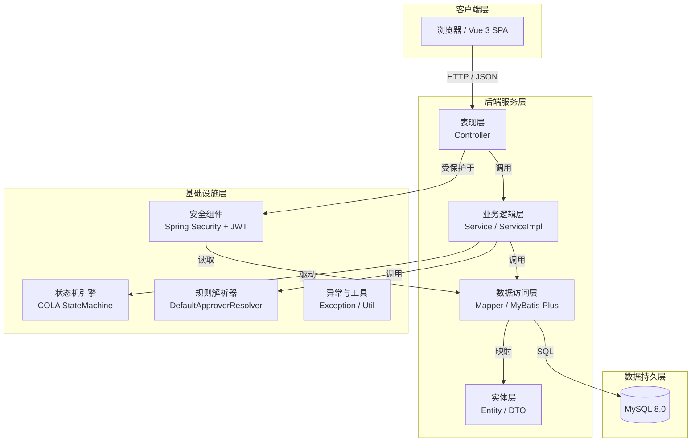
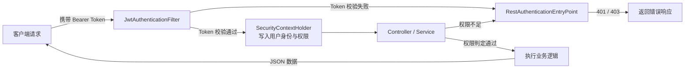
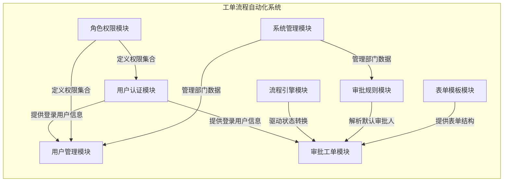
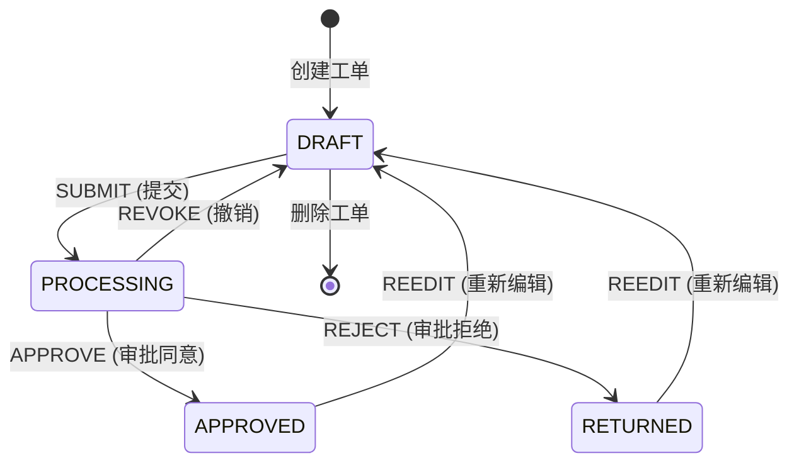
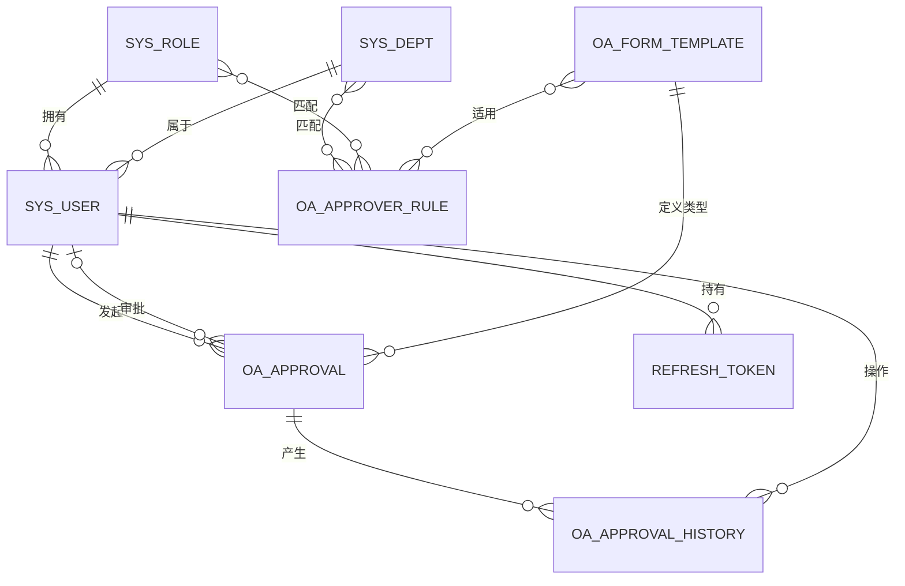

# 第4章 工单流程自动化系统总体设计

## 4.1 系统体系架构

### 4.1.1 分层架构设计

本系统采用前后端分离的 B/S（Browser/Server）架构风格。前端基于 Vue 3 构建单页应用（SPA），通过 HTTP/RESTful API 与后端进行数据交互；后端基于 Spring Boot 3.2 构建，采用经典的分层架构模式，自上而下划分为表现层、业务逻辑层、数据访问层及基础设施层。各层之间职责边界清晰，通过接口与依赖注入实现解耦，便于后续的功能扩展与单元测试。

后端项目按功能模块组织包结构，根包为 `com.oasystem`，其子包划分如下：

- **controller**：表现层，负责接收 HTTP 请求、参数校验及响应封装，直接对接前端调用。
- **service / service.impl**：业务逻辑层，封装领域业务规则与流程编排，是系统的核心运算层。
- **mapper**：数据访问层，基于 MyBatis-Plus 定义数据库访问接口，实现对象关系映射（ORM）。
- **entity**：实体层，定义与数据库表一一对应的 POJO 对象。
- **dto**：数据传输层，定义前后端交互的请求体（Request）与响应体（Response）。
- **config**：配置层，集中管理框架配置，如 Spring Security、COLA 状态机等。
- **security**：安全层，实现 JWT 认证过滤器、用户详情服务及访问控制处理器。
- **statemachine**：状态机层，封装 COLA 状态机的配置、上下文及状态流转辅助逻辑。
- **resolver**：审批规则解析层，实现默认审批人的自动解析与匹配策略。
- **exception**：异常处理层，定义全局异常拦截器与业务异常类型。
- **enums**：枚举层，集中管理状态、事件、权限等枚举常量。
- **util**：工具层，提供 JWT 生成与解析、密码加密等通用工具。

**Mermaid 分层架构图代码：**

**文字说明：**

客户端层通过浏览器运行 Vue 3 单页应用，用户的所有操作均以 HTTP 请求形式发送至后端。后端表现层（Controller）接收请求后进行参数校验，随后调用业务逻辑层（Service）处理领域业务。业务逻辑层根据需要驱动状态机引擎（COLA StateMachine）完成工单状态转换，或调用规则解析器（DefaultApproverResolver）自动分配审批人。数据访问层（Mapper）通过 MyBatis-Plus 将实体对象映射为 SQL 语句，最终与 MySQL 数据库交互。安全组件（Spring Security + JWT）以过滤器形式横切所有请求，在表现层之前完成身份认证与权限判定。

### 4.1.2 安全架构设计

系统安全架构围绕认证（Authentication）与授权（Authorization）两条主线展开。认证机制采用无状态的 JWT（JSON Web Token）方案，避免服务端 Session 存储带来的水平扩展限制；授权模型采用基于角色的访问控制（RBAC），通过 `sys_role` 表中的权限 JSON 字段定义角色可访问的资源集合。

为进一步提升安全性，系统实现了双 Token 刷新策略：
- **Access Token**：有效期 30 分钟，承载用户 ID 与用户名，用于常规接口的身份校验。
- **Refresh Token**：有效期 7 天，专用于在 Access Token 过期时换取新的 Access Token，实现用户会话的可续期性，同时降低长期 Token 泄露的风险。

在审批业务场景中，系统还实现了四层权限检查机制：指定审批人直接审批、管理员全范围代审批、部门经理本部门代审批、无权限拒绝。此外，数据权限控制确保普通员工仅可查看自己发起的工单，部门经理可查看本部门工单，管理员可查看全系统工单。

安全过滤流程如下：请求首先经过 `JwtAuthenticationFilter` 过滤器，从请求头中提取 Bearer Token 并校验其合法性与有效期；若校验通过，过滤器将用户信息封装为 `UsernamePasswordAuthenticationToken` 并写入 Spring Security 上下文，供后续的方法级安全注解（`@PreAuthorize`）或自定义权限逻辑使用；若校验失败，则将具体错误原因（如 token_missing、token_expired、token_invalid）写入请求属性，由 `RestAuthenticationEntryPoint` 统一返回标准化错误响应。

**Mermaid 安全请求处理流程图代码：**

**文字说明：**

客户端在请求头中携带 `Authorization: Bearer <token>` 访问后端接口。请求首先进入 `JwtAuthenticationFilter`，该过滤器提取 Token 并校验其合法性与有效期。若 Token 缺失、过期或签名无效，过滤器将错误原因写入请求属性，交由 `RestAuthenticationEntryPoint` 统一返回 401 响应。若 Token 校验通过，过滤器解析出用户身份，加载角色与权限列表，并构建 `UsernamePasswordAuthenticationToken` 存入 Security 上下文。随后请求进入 Controller，业务层通过方法安全注解或自定义逻辑进行权限判定：具备相应权限则执行业务逻辑并返回数据，权限不足则触发 `AccessDeniedHandler` 返回 403 错误。整个安全过滤流程对业务代码透明，实现了认证与授权的横切分离。

---

## 4.2 系统模块设计

依据功能内聚与职责单一原则，系统将业务功能划分为八大模块。各模块之间通过 Service 接口调用产生依赖，底层共享同一套数据持久化与安全基础设施。

**Mermaid 系统功能模块图代码：**

用户认证模块是整个系统的安全入口，封装了基于 Spring Security 与 JWT 的无状态认证体系。该模块不仅处理常规的登录登出与密码加密校验，还实现了双 Token 刷新机制：Access Token 承载用户身份供接口校验，Refresh Token 用于会话续期，二者分别设置 30 分钟与 7 天的过期时间，以降低 Token 泄露后的风险敞口。用户管理与角色权限模块共同构成 RBAC 权限模型的数据底座。用户管理负责维护用户基本信息及其与部门、角色的归属关系；角色权限模块则将权限编码以 JSON 数组形式存储于 `sys_role` 表中，支持 `all` 通配与细粒度编码两种授权模式，并在运行时由 `UserDetailsServiceImpl` 解析加载为 Spring Security 的 `GrantedAuthority` 集合。系统管理模块主要维护部门层级结构，通过 `parent_id` 自关联实现树形组织架构，为审批规则中的部门匹配与数据权限过滤提供基础数据支撑。

审批工单模块是系统的核心业务模块，承担工单的完整生命周期管理，包括创建、编辑、删除、分页查询及详情查看。为避免敏感数据越权访问，该模块在查询层面内嵌了三级数据权限隔离逻辑：系统管理员可查看全部工单，部门经理可查看本部门员工发起的工单以及指派给自己的待办，普通员工仅能查看自己发起的工单。流程引擎模块基于阿里巴巴 COLA 状态机实现，将工单状态转换抽象为状态、事件、条件、动作四要素，所有状态跳转均需通过状态机引擎驱动，从而从架构层面杜绝非法状态变更。表单模板模块为审批工单提供动态表单能力，其字段配置以 JSON 格式持久化，前端表单设计器通过解析该 JSON 实现控件的动态渲染，工单的 `form_data` 字段则按同一结构存储用户填写的实际数据，实现模板与实例的解耦。审批规则模块负责在工单创建或提交阶段自动解析默认审批人，其内部实现了按部门角色与固定人员两种策略，并支持基于部门、审批类型、角色三维度的匹配条件；当规则匹配失败时，系统会触发兜底策略，自动查找申请人所在部门下具备经理角色的用户作为审批人，同时严格校验防止申请人自审。

---

## 4.3 流程引擎设计

### 4.3.1 状态机模型设计

审批工单的生命周期由状态机严格管控。系统定义了五种离散状态（`ApprovalStatus`）和五种触发事件（`ApprovalEvent`），所有状态变更必须通过状态机引擎完成，避免非法跳转。

状态定义如下：

系统定义了五种离散状态以刻画工单生命周期。DRAFT（编码 0）为草稿状态，是工单创建后的初始状态，仅申请人可编辑或删除；PROCESSING（编码 1）为审批中状态，表示工单已提交并等待当前审批人处理；APPROVED（编码 2）为已通过状态，标志审批流程正常结束；RETURNED（编码 3）为已打回状态，由审批人拒绝后产生，申请人可重新编辑并再次提交；REVOKED（编码 4）为已撤销状态，表示申请人在审批中主动撤回申请。

与之对应，系统定义了五种触发事件以驱动状态迁移。SUBMIT（编码 0）事件由申请人发起，将草稿状态推进为审批中；APPROVE（编码 1）事件由具备权限的审批人执行，将审批中转为已通过；REJECT（编码 2）事件同样由审批人执行，将审批中转为已打回；REEDIT（编码 3）事件允许申请人对已通过或已打回的工单重新编辑，使其回到草稿状态；REVOKE（编码 4）事件允许申请人在审批中主动撤销，使工单回归草稿。

**Mermaid 状态流转图代码：**

**文字说明：**

工单创建后默认进入 **DRAFT（草稿）** 状态，此状态下申请人拥有完全控制权，可修改内容或删除工单。当申请人执行 **SUBMIT（提交）** 事件且表单数据校验通过后，工单进入 **PROCESSING（审批中）** 状态，此时系统根据审批规则自动或手动指定当前审批人。处于审批中的工单可被当前审批人执行 **APPROVE（同意）** 或 **REJECT（拒绝）** 操作，分别流转至 **APPROVED（已通过）** 或 **RETURNED（已打回）** 状态；申请人也可在审批中执行 **REVOKE（撤销）** 操作，使工单回到草稿。对于已通过或已打回的工单，申请人可执行 **REEDIT（重新编辑）** 事件，再次回到草稿状态进行内容修正后重新发起审批。

### 4.3.2 状态流转规则设计

状态机中的每一次外部转换（External Transition）均包含三个核心要素：源状态、目标状态、触发事件，以及两个可扩展钩子：前置条件（Condition）和转换动作（Action）。系统共配置了六条合法转换规则。第一条规则由 DRAFT 转向 PROCESSING，触发事件为 SUBMIT，其前置条件要求工单表单数据完整，即 `form_data` 字段不得为空。第二条与第三条规则均从 PROCESSING 状态出发，分别由 APPROVE 事件转向 APPROVED、由 REJECT 事件转向 RETURNED，二者共享同一前置条件——当前操作人必须具备审批权限，该权限判定采用四层检查机制：指定审批人直接审批、管理员全范围代审批、部门经理本部门代审批，均不满足则拒绝。第四条规则由 PROCESSING 经 REVOKE 事件回到 DRAFT，要求当前操作人必须为工单申请人本人，即 `operatorId` 与 `applicantId` 相等。第五条与第六条规则分别由 APPROVED 和 RETURNED 经 REEDIT 事件回到 DRAFT，同样要求操作人为申请人本人。

### 4.3.3 状态转换动作设计

状态转换动作（Action）负责在状态变更成功后的副作用执行，包括持久化状态更新、记录历史轨迹及审计日志。各事件对应动作设计如下：

- **SUBMIT 动作（`doSubmit`）**：将工单状态码更新为 PROCESSING；若操作命令中携带了下一审批人 ID，则校验该用户是否存在且具备审批权限，校验通过后写入 `current_approver_id` 字段；最后向 `oa_approval_history` 表插入一条操作记录，动作类型为提交。
- **APPROVE 动作（`doApprove`）**：将工单状态码更新为 APPROVED，并清空 `current_approver_id` 表示流程结束；从上下文中获取权限检查结果，若属于代审批，则在审批意见前追加代审批类型标识；将审批历史记录持久化，同时写入 `approval_type`、`is_proxy`、`original_approver_id` 等代审计字段；输出审计日志。
- **REJECT 动作（`doReject`）**：将工单状态码更新为 RETURNED，并清空 `current_approver_id`；其余逻辑与 APPROVE 动作对称，包括代审批标识追加与历史记录持久化。
- **REEDIT 动作（`doReedit`）**：将工单状态码更新为 DRAFT；若上下文携带了更新参数，同步覆盖工单的标题、优先级、内容、表单数据及审批人信息；记录重新编辑的历史轨迹。
- **REVOKE 动作（`doRevoke`）**：将工单状态码更新为 DRAFT，并清空 `current_approver_id`；记录撤销操作的历史轨迹。

所有动作均在数据库事务保护下执行，任何一步异常（如历史记录保存失败）将触发事务回滚，确保工单状态与历史记录的一致性。

### 4.3.4 状态机配置与初始化

系统采用阿里巴巴开源的 COLA 状态机（版本 5.0.0）作为流程引擎底座。COLA 状态机采用 Builder 模式构建，支持通过链式 API 声明状态转换规则。状态机的配置集中定义在 `StateMachineConfig` 配置类中，以 Spring Bean 形式初始化并注册到 `StateMachineFactory`。

配置类通过 `StateMachineBuilderFactory.create()` 创建构造器，依次调用 `externalTransition()` 声明六条转换规则，每条规则通过 `.from()`、`.to()`、`.on()` 限定状态与事件，通过 `.when()` 绑定条件检查方法，通过 `.perform()` 绑定动作执行方法。最终调用 `.build("approvalStateMachine")` 完成状态机实例化。为避免集成测试场景下 Spring 上下文刷新导致的状态机重复注册异常，配置类在构建前通过反射检查并清理工厂中已存在的同名状态机实例。

### 4.3.5 状态机上下文与参数传递

状态流转过程中需要携带大量业务数据，包括工单实体、操作命令、当前操作人及权限检查结果。系统定义了 `ApprovalContext` 上下文对象作为状态机统一的数据载体，其结构如下：

- **approval**：当前操作的审批工单实体，包含完整的业务字段与当前状态。
- **cmd**：审批操作命令（`ApprovalActionCmd`），封装审批意见、下一审批人 ID 等前端传入参数。
- **operatorId**：当前执行操作的登录用户 ID，用于身份校验与历史记录归因。
- **permissionResult**：权限检查结果（`ApprovalPermissionResult`），在审批同意/拒绝场景下由前置条件检查生成，传递给动作方法以区分直接审批与代审批，并记录原审批人信息。

在 Service 层调用状态机时，首先构造 `ApprovalContext`，然后根据业务场景选择性地预填充 `permissionResult`。状态机引擎将同一上下文对象依次传递给条件检查方法与动作执行方法，实现数据的无状态传递。

### 4.3.6 与审批规则引擎的衔接

当前系统尚未实现完全独立的规则引擎，审批决策逻辑以组件形式嵌入在状态机的条件检查与 Service 层业务方法中。具体而言，`ApprovalStateMachineHelper` 中的 `checkApproverPermissionDetail` 方法承担了审批权限判定职责，其内部实现了四层审批权限检查逻辑；而 `DefaultApproverResolver` 组件则承担了默认审批人解析职责，支持按部门角色和固定人员两种策略自动匹配审批人。

在工单创建与提交阶段，Service 层会调用 `DefaultApproverResolver.resolve()` 自动解析默认审批人。该解析器按优先级依次遍历 `oa_approver_rule` 表中启用的规则，根据申请人所在部门、工单类型等匹配条件定位适用规则，再按规则指定的策略类型解析出具体审批人 ID。若规则匹配失败，则触发兜底策略：查找申请人所在部门下具备经理角色的其他用户作为审批人，严格防止申请人自审。

从架构演进角度看，当前的审批权限判定与规则解析虽已具备初步的模块化特征，但仍与状态机辅助类和业务 Service 存在耦合。后续可进一步将 `DefaultApproverResolver` 抽象为独立的规则引擎接口，支持 Drools 或自研规则 DSL，实现审批规则的外部化配置与热更新，从而满足更复杂的动态审批流需求。

---

## 4.4 数据库设计

### 4.4.1 数据库概念结构设计

在工单流程自动化系统设计中，包含8个实体，包括部门信息、角色信息、用户信息、审批工单信息、审批历史信息、表单模板信息、审批规则信息和刷新令牌信息。

（1）部门信息，存储企业组织架构中的部门数据，是用户归属定位与审批规则按部门匹配的基础。此实体属性包含如下：部门ID，唯一标识每个部门；上级部门ID，支持部门层级结构；部门名称；部门编码；部门描述；排序号；状态；创建时间；更新时间。

（2）角色信息，存储系统角色定义及权限编码集合，是RBAC权限模型的核心数据载体。此实体属性包含如下：角色ID，唯一标识每个角色；角色标识；角色显示名；角色描述；权限编码集合，以JSON数组格式存储角色的全部权限；创建时间。

（3）用户信息，存储系统注册用户的基本资料及组织归属关系，是工单发起与审批操作的行为主体。此实体属性包含如下：用户ID，唯一标识每个用户；用户名；密码，采用BCrypt算法加密存储；真实姓名；邮箱；手机号；头像URL；角色ID，逻辑关联角色信息；部门ID，逻辑关联部门信息；状态；创建时间；更新时间。

（4）审批工单信息，存储审批流程中的业务工单数据，是系统核心业务流程的载体。此实体属性包含如下：工单ID，唯一标识每条工单；审批标题；审批类型，对应表单模板编码；申请人ID，逻辑关联用户信息；当前审批人ID，逻辑关联用户信息；状态，标识工单所处生命周期阶段；优先级；申请内容；表单数据，以JSON格式存储用户填写的动态表单内容；创建时间；更新时间。

（5）审批历史信息，记录审批工单每一次状态变更的完整轨迹，是流程审计与操作追溯的关键依据。此实体属性包含如下：历史记录ID；关联工单ID；操作人ID，逻辑关联用户信息；操作类型，标识提交、同意、拒绝、重新编辑或撤销；审批意见；操作时间；审批类型编码，标识直接审批或代审批；是否代审批；原指定审批人ID；代审批原因。

（6）表单模板信息，存储可视化表单的设计配置，为审批工单提供动态字段结构支持。此实体属性包含如下：模板ID，唯一标识每个表单模板；表单名称；表单编码；表单描述；字段配置，以JSON格式存储表单字段定义；流程配置标识；状态；创建时间。

（7）审批规则信息，存储默认审批人的自动匹配规则，是工单提交时自动分配审批人的决策依据。此实体属性包含如下：规则ID，唯一标识每条规则；规则名称；策略类型，标识按部门角色或固定人员两种策略；匹配条件，以JSON格式存储部门、审批类型、角色等匹配维度；审批人类型；审批人值；优先级；状态；规则描述；作用范围；创建时间；更新时间。

（8）刷新令牌信息，存储JWT刷新令牌数据，用于实现双Token策略中的会话续期机制。此实体属性包含如下：记录ID；用户ID，逻辑关联用户信息；Refresh Token字符串；过期时间；创建时间；是否已撤销。

各实体之间的关系如下：角色信息与用户信息为一对多关系，一个角色可分配给多名用户；部门信息与用户信息为一对多关系，一个部门可包含多名用户，同时部门信息通过上级部门ID实现自关联以支持层级结构；审批工单信息与用户信息存在两条多对一关联，分别是申请人关联和当前审批人关联；表单模板信息与审批工单信息为一对多关系，一种表单模板可对应多条工单；审批工单信息与审批历史信息为一对多关系，一条工单可产生多条历史记录；审批历史信息与用户信息为多对一关系，记录具体操作人；审批规则信息与部门信息、角色信息及表单模板信息均为逻辑上的多对多关系，通过JSON字段存储匹配条件与审批人取值实现关联；刷新令牌信息与用户信息为一对多关系，一名用户可同时持有多枚刷新令牌以支持多端登录场景。

**Mermaid ER 图代码：**

**文字说明：**

`sys_role` 与 `sys_user` 为一对多关系，一个角色可分配给多名用户。`sys_dept` 与 `sys_user` 为一对多关系，一个部门可包含多名用户；同时 `sys_dept` 通过 `parent_id` 实现自关联，支持部门层级结构。`oa_approval` 与 `sys_user` 存在两条关联：一是申请人（`applicant_id`），二是当前审批人（`current_approver_id`），均为多对一关系。`oa_form_template` 与 `oa_approval` 为一对多关系，一种表单模板可对应多条工单。`oa_approval` 与 `oa_approval_history` 为一对多关系，记录工单的完整生命周期轨迹；历史记录中的操作人通过 `approver_id` 关联 `sys_user`。

`oa_approver_rule` 通过 `match_conditions` 与 `approver_value` 字段以 JSON 形式与 `sys_dept`、`sys_role`、`oa_form_template` 建立逻辑多对多关联，用于在工单提交阶段按部门、角色与审批类型匹配适用规则并解析具体审批人。`refresh_token` 通过 `user_id` 字段与 `sys_user` 形成一对多关联，记录单一用户在多端登录场景下持有的会话凭证。上述关联均不设置物理外键约束，由应用层在数据写入与查询路径中完成完整性校验。

### 4.4.2 数据库逻辑结构设计

系统采用 MySQL 8.0 作为关系型数据库，字符集统一为 `utf8mb4` 以支持完整 Unicode 字符存储。以下列出各核心数据表的逻辑结构，字段类型与约束基于实体类及数据库初始化脚本整理。

**（1）部门表（`sys_dept`）**

| 字段名 | 类型 | 主/外键 | 说明 |
|--------|------|---------|------|
| id | BIGINT | PK | 部门唯一标识，自增 |
| parent_id | BIGINT | FK（逻辑） | 上级部门 ID，支持层级 |
| name | VARCHAR(100) | | 部门名称，非空 |
| code | VARCHAR(50) | UK | 部门编码，唯一 |
| description | VARCHAR(200) | | 部门描述 |
| sort_order | INT | | 排序号，默认 0 |
| status | TINYINT | | 状态：0 禁用，1 启用 |
| create_time | DATETIME | | 创建时间 |
| update_time | DATETIME | | 更新时间 |

**（2）角色表（`sys_role`）**

| 字段名 | 类型 | 主/外键 | 说明 |
|--------|------|---------|------|
| id | BIGINT | PK | 角色唯一标识，自增 |
| name | VARCHAR(50) | UK | 角色标识，唯一 |
| label | VARCHAR(100) | | 角色显示名 |
| description | VARCHAR(500) | | 角色描述 |
| permissions | JSON | | 权限编码集合，JSON 数组格式 |
| create_time | DATETIME | | 创建时间 |

**（3）用户表（`sys_user`）**

| 字段名 | 类型 | 主/外键 | 说明 |
|--------|------|---------|------|
| id | BIGINT | PK | 用户唯一标识，自增 |
| username | VARCHAR(50) | UK | 用户名，唯一 |
| password | VARCHAR(100) | | 密码，BCrypt 加密存储 |
| name | VARCHAR(50) | | 真实姓名 |
| email | VARCHAR(100) | | 邮箱 |
| phone | VARCHAR(20) | | 手机号 |
| avatar | VARCHAR(200) | | 头像 URL |
| role_id | BIGINT | FK（逻辑） | 角色 ID |
| dept_id | BIGINT | FK（逻辑） | 部门 ID |
| status | TINYINT | | 状态：0 禁用，1 启用 |
| create_time | DATETIME | | 创建时间 |
| update_time | DATETIME | | 更新时间 |

索引设计：`idx_role_id`、`idx_dept_id`、`idx_status` 分别加速按角色、部门、状态的查询。

**（4）审批工单表（`oa_approval`）**

| 字段名 | 类型 | 主/外键 | 说明 |
|--------|------|---------|------|
| id | BIGINT | PK | 工单唯一标识，自增 |
| title | VARCHAR(200) | | 审批标题 |
| type | VARCHAR(50) | | 审批类型（表单模板编码） |
| applicant_id | BIGINT | FK（逻辑） | 申请人 ID |
| current_approver_id | BIGINT | FK（逻辑） | 当前审批人 ID |
| status | TINYINT | | 状态：0 草稿，1 审批中，2 已通过，3 已打回，4 已撤销 |
| priority | TINYINT | | 优先级：0 低，1 普通，2 紧急 |
| content | TEXT | | 申请内容 |
| form_data | JSON | | 表单数据，JSON 格式 |
| create_time | DATETIME | | 创建时间 |
| update_time | DATETIME | | 更新时间 |

索引设计：`idx_applicant_id`、`idx_current_approver_id`、`idx_status`、`idx_type`、`idx_create_time` 覆盖工单列表查询的主要筛选维度。

**（5）审批历史表（`oa_approval_history`）**

| 字段名 | 类型 | 主/外键 | 说明 |
|--------|------|---------|------|
| id | BIGINT | PK | 记录唯一标识，自增 |
| approval_id | BIGINT | FK（逻辑） | 关联工单 ID |
| approver_id | BIGINT | FK（逻辑） | 操作人 ID |
| action | TINYINT | | 操作类型：0 提交，1 同意，2 拒绝，3 重新编辑，4 撤销 |
| comment | VARCHAR(500) | | 审批意见 |
| create_time | DATETIME | | 操作时间 |
| approval_type | VARCHAR(50) | | 审批类型编码：DIRECT / PROXY_ADMIN / PROXY_MANAGER |
| is_proxy | TINYINT | | 是否代审批：0 否，1 是 |
| original_approver_id | BIGINT | | 原指定审批人 ID |
| proxy_reason | VARCHAR(100) | | 代审批原因 |

索引设计：`idx_approval_id`、`idx_approver_id`、`idx_create_time` 加速按工单、操作人及时间的查询。

**（6）表单模板表（`oa_form_template`）**

| 字段名 | 类型 | 主/外键 | 说明 |
|--------|------|---------|------|
| id | BIGINT | PK | 模板唯一标识，自增 |
| name | VARCHAR(100) | | 表单名称 |
| code | VARCHAR(50) | UK | 表单编码，唯一 |
| description | VARCHAR(500) | | 表单描述 |
| fields_config | JSON | | 字段配置，JSON 数组格式 |
| flow_config | VARCHAR(50) | | 流程配置标识 |
| status | TINYINT | | 状态：0 禁用，1 启用 |
| create_time | DATETIME | | 创建时间 |

**（7）审批规则表（`oa_approver_rule`）**

| 字段名 | 类型 | 主/外键 | 说明 |
|--------|------|---------|------|
| id | BIGINT | PK | 规则唯一标识，自增 |
| name | VARCHAR(100) | | 规则名称 |
| strategy_type | TINYINT | | 策略类型：1 按部门角色，3 固定人员 |
| match_conditions | JSON | | 匹配条件（部门、类型、角色） |
| approver_type | TINYINT | | 审批人类型：1 指定用户，2 指定角色 |
| approver_value | VARCHAR(500) | | 审批人值，JSON 格式 |
| priority | INT | | 优先级，数字越小越优先 |
| status | TINYINT | | 状态：0 禁用，1 启用 |
| description | VARCHAR(500) | | 规则描述 |
| scope_type | TINYINT | | 作用范围：1 全局，2 指定部门，3 指定角色 |
| create_time | DATETIME | | 创建时间 |
| update_time | DATETIME | | 更新时间 |

索引设计：`idx_strategy_type`、`idx_status`、`idx_priority` 加速规则筛选与排序。

**（8）刷新令牌表（`refresh_token`）**

| 字段名 | 类型 | 主/外键 | 说明 |
|--------|------|---------|------|
| id | BIGINT | PK | 记录唯一标识，自增 |
| user_id | BIGINT | FK（逻辑） | 用户 ID |
| token | VARCHAR(500) | | Refresh Token 字符串 |
| expires_at | DATETIME | | 过期时间 |
| created_at | DATETIME | | 创建时间 |
| revoked | TINYINT | | 是否已撤销：0 有效，1 已撤销 |

---

⚠️ 本章设计内容基于项目实际代码生成，其中的 Mermaid 代码可在线渲染为图片后插入 Word。
