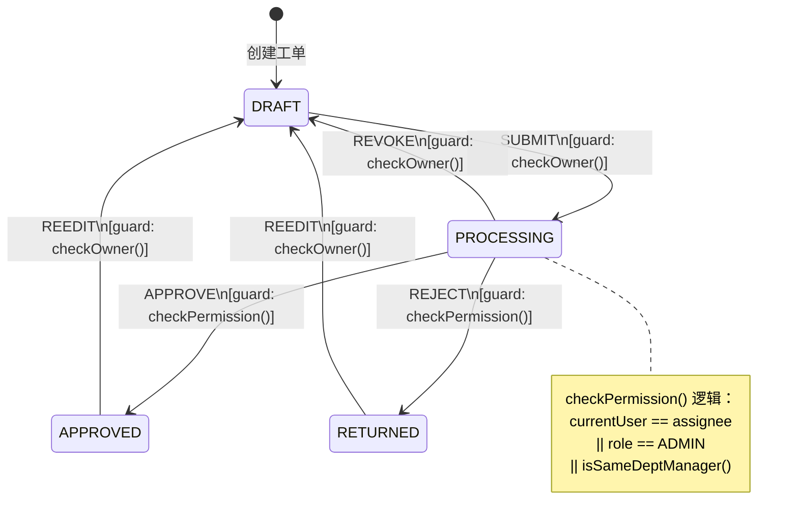
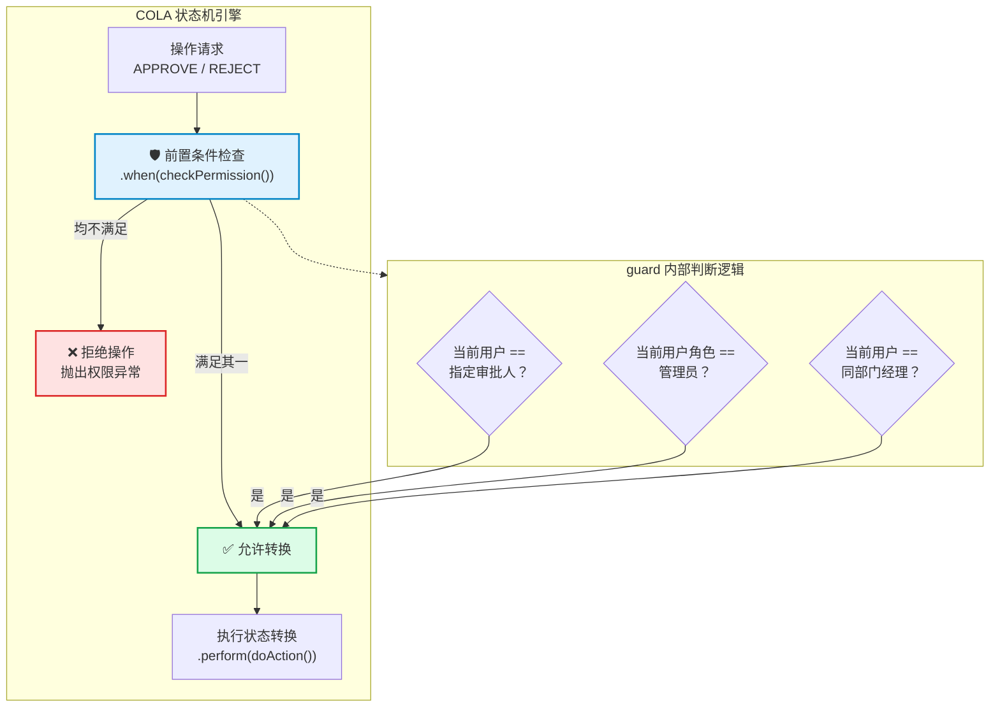
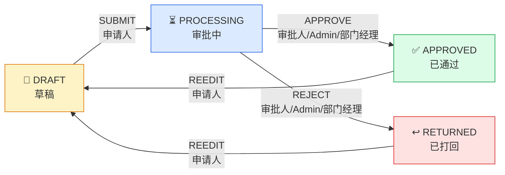
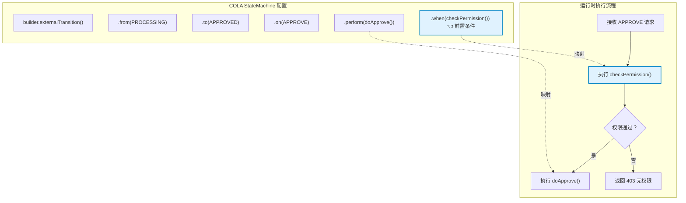

# 答辩PPT Mermaid 图表

## 方案一：带权限守卫的状态转换图

```mermaid
stateDiagram-v2
    [*] --> DRAFT : 创建工单

    DRAFT --> PROCESSING : SUBMIT\n[guard: checkOwner()]

    PROCESSING --> APPROVED : APPROVE\n[guard: checkPermission()]
    PROCESSING --> RETURNED : REJECT\n[guard: checkPermission()]
    PROCESSING --> DRAFT : REVOKE\n[guard: checkOwner()]

    APPROVED --> DRAFT : REEDIT\n[guard: checkOwner()]
    RETURNED --> DRAFT : REEDIT\n[guard: checkOwner()]

    note right of PROCESSING
        checkPermission() 逻辑：
        currentUser == assignee
        || role == ADMIN
        || isSameDeptManager()
    end note
```

---

## 方案二：权限检查守卫放大图（重点突出前置条件）

```mermaid
flowchart TB
    subgraph StateMachine["COLA 状态机引擎"]
        direction TB
        Request["操作请求<br/>APPROVE / REJECT"]
        Guard["🛡️ 前置条件检查<br/>.when(checkPermission())"]
        Allow["✅ 允许转换"]
        Deny["❌ 拒绝操作<br/>抛出权限异常"]
        Transition["执行状态转换<br/>.perform(doAction())"]
    end

    Request --> Guard
    Guard -->|满足其一| Allow
    Guard -->|均不满足| Deny
    Allow --> Transition

    subgraph GuardLogic["guard 内部判断逻辑"]
        direction LR
        A{"当前用户 ==<br/>指定审批人？"}
        B{"当前用户角色 ==<br/>管理员？"}
        C{"当前用户 ==<br/>同部门经理？"}
    end

    Guard -.-> GuardLogic
    A -->|是| Allow
    B -->|是| Allow
    C -->|是| Allow

    style Guard fill:#e0f2fe,stroke:#0284c7,stroke-width:2px
    style Allow fill:#dcfce7,stroke:#16a34a,stroke-width:2px
    style Deny fill:#fee2e2,stroke:#dc2626,stroke-width:2px
```

---

## 方案三：简洁版状态+权限合一图（适合PPT单页）

```mermaid
flowchart LR
    DRAFT["📝 DRAFT<br/>草稿"]
    PROCESSING["⏳ PROCESSING<br/>审批中"]
    APPROVED["✅ APPROVED<br/>已通过"]
    RETURNED["↩️ RETURNED<br/>已打回"]

    DRAFT -->|"SUBMIT<br/>申请人"| PROCESSING
    PROCESSING -->|"APPROVE<br/>审批人/Admin/部门经理"| APPROVED
    PROCESSING -->|"REJECT<br/>审批人/Admin/部门经理"| RETURNED
    APPROVED -->|"REEDIT<br/>申请人"| DRAFT
    RETURNED -->|"REEDIT<br/>申请人"| DRAFT

    style DRAFT fill:#fef3c7,stroke:#d97706
    style PROCESSING fill:#dbeafe,stroke:#2563eb
    style APPROVED fill:#dcfce7,stroke:#16a34a
    style RETURNED fill:#fee2e2,stroke:#dc2626
```

---

## 方案四：COLA 状态机配置代码映射图

```mermaid
flowchart TB
    subgraph Code["COLA StateMachine 配置"]
        C1["builder.externalTransition()"]
        C2[".from(PROCESSING)"]
        C3[".to(APPROVED)"]
        C4[".on(APPROVE)"]
        C5[".when(checkPermission()) 👈 前置条件"]
        C6[".perform(doApprove())"]
    end

    subgraph Runtime["运行时执行流程"]
        R1["接收 APPROVE 请求"]
        R2["执行 checkPermission()"]
        R3{"权限通过？"}
        R4["执行 doApprove()"]
        R5["返回 403 无权限"]
    end

    C5 -. 映射 .-> R2
    C6 -. 映射 .-> R4

    R1 --> R2
    R2 --> R3
    R3 -->|是| R4
    R3 -->|否| R5

    style C5 fill:#e0f2fe,stroke:#0284c7,stroke-width:2px
    style R2 fill:#e0f2fe,stroke:#0284c7,stroke-width:2px
```
